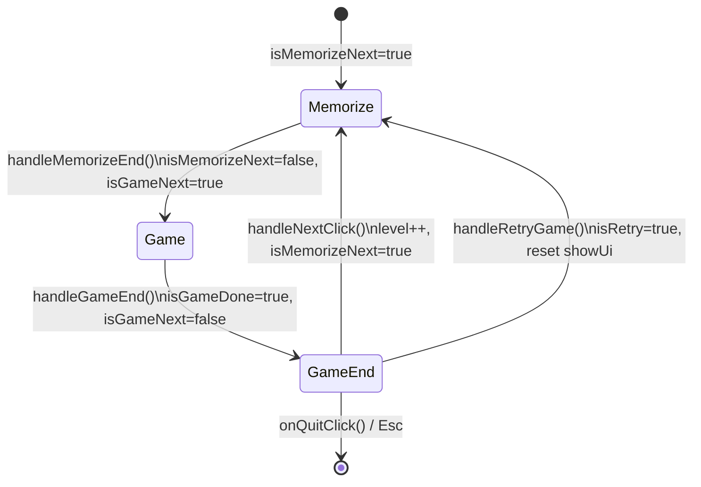
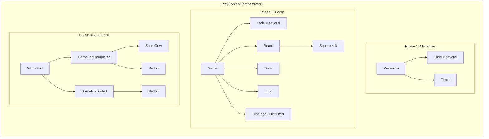
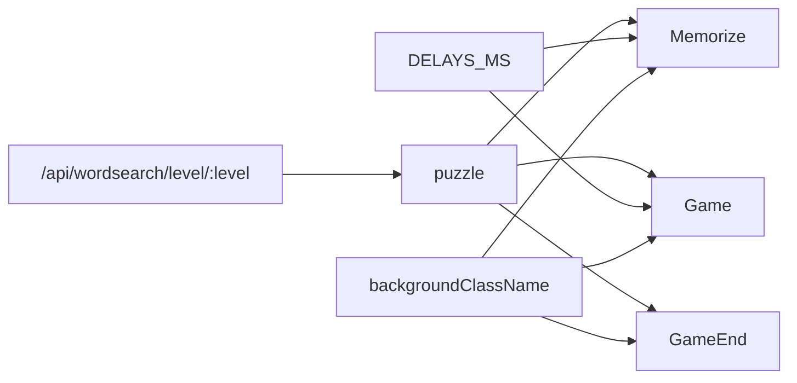

# Play Page – Game Phases (Mermaid)

## Phase flow

```mermaid
flowchart LR
    subgraph phases[" "]
        A[1. Memorize]
        B[2. Game]
        C[3. GameEnd]
    end
    A -->|timer ends| B
    B -->|win or time up| C
    C -->|Next level| A
    C -->|Retry| A
    C -->|Quit| EXIT[/ or home]
```

## State machine (showUi)



## Component tree by phase



## Component tree (text)

Plain hierarchy of components used on the play page (one phase visible at a time):

```
Play (route)
  └── PlayContent
        ├── [phase 1] Memorize
        │     ├── Fade (× several)
        │     └── Timer
        ├── [phase 2] Game
        │     ├── Fade (× several)
        │     ├── Board → Square (× N)
        │     ├── Timer
        │     ├── Logo
        │     └── HintLogo / HintTimer
        └── [phase 3] GameEnd
              ├── GameEndCompleted
              │     ├── Fade
              │     ├── ScoreRow (× several)
              │     └── Button (× 2)
              └── GameEndFailed
                    ├── Fade
                    └── Button (× 2)
```

## Data flow



## Phase summary table (for reference)

| Phase   | Condition              | Main component | Sub-components / UI                         |
|---------|-------------------------|----------------|---------------------------------------------|
| Memorize | `isMemorizeNext`       | Memorize       | Fade, Timer                                 |
| Game   | `isGameNext`            | Game           | Fade, Board, Square, Timer, Logo, Hint*     |
| GameEnd | `isGameDone`           | GameEnd        | GameEndCompleted / GameEndFailed, Button    |

\* HintLogo, HintTimer (dismissible)
